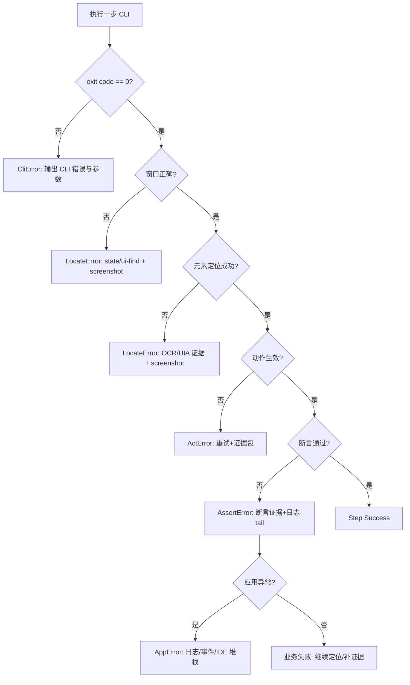

# 2026-02-03：错误观测与报告流水线（Windows.Agent）

## 1. 目标

当 AI 使用 `windows-agent` 对桌面应用 A 执行自动化测试时，失败来源可能来自多个层次：

- CLI/执行器自身错误
- 窗口/控件定位错误
- 点击/输入动作未生效
- 断言失败（业务未达到预期）
- 被测应用自身异常（崩溃/堆栈/日志报错）

本流水线目标是：

1) **分层定位错误归属**（可复现、可审计）  
2) **采集最小但充分的证据包**（Artifacts）  
3) **把结构化错误报告交给上层 AI**（用于重试/回滚/修复建议）  

## 2. 错误分层模型（必须用统一术语）

| 错误层 | 名称 | 典型表现 | 建议证据 |
|---|---|---|---|
| 执行器层 | `CliError` | 参数错误、缺少 `--dangerous`、未知命令、CLI 崩溃 | exit code、CLI error message、stack（如有） |
| 工具层 | `ToolError` | Tool/Service 抛异常或返回明确错误 | tool 名称、输入参数、raw/parsed 输出、异常信息 |
| 定位层 | `LocateError` | 窗口不是目标、元素找不到、坐标不在窗口内 | `desktop state`、窗口矩形、OCR/UIA 命中证据、screenshot |
| 动作层 | `ActError` | 点击/输入执行了但不生效（焦点不在、控件不可交互） | 前/后 screenshot、前台窗口、UIA 属性（未来）、重试记录 |
| 断言层 | `AssertError` | 业务结果不符合预期（按钮点了但没成功） | 断言输入/输出、OCR 命中/未命中、日志 tail |
| 应用层 | `AppError` | 被测应用崩溃、抛堆栈、日志出现异常 | 应用日志片段、事件日志（可选）、IDE 调试输出（可选） |

> 说明：`ToolError` 与 `LocateError/ActError/AssertError` 在报告中必须区分，否则 AI 无法判断应“修执行器”还是“修用例/定位/应用”。

## 3. 证据包（Artifact Bundle）规范

失败时必须采集最小证据包（可扩展）：

### 3.1 标准 artifacts 列表（建议最小集）

| kind | 内容 | 采集方式（当前/未来） |
|---|---|---|
| `screenshot` | 屏幕截图文件路径 | `desktop screenshot`（当前） |
| `desktop_state` | 前台窗口/可见窗口列表（文本） | `desktop state`（当前） |
| `window_match` | 目标窗口匹配证据（标题、矩形） | `desktop ui-find` 或 `desktop uia-find`（当前） |
| `ocr_hit` | OCR 命中（文本、坐标、置信度） | `ocr coords/find`（当前） |
| `app_log_tail` | 应用日志末尾 N 行 | `diag tail-log`（当前）或 `fs read` |
| `event_log` | Windows 事件日志片段（可选） | 未来 `diag eventlog` |

### 3.2 证据对象结构（建议）

建议每个 artifact 在报告中统一为：

```json
{
  "kind": "screenshot",
  "path": "C:\\temp\\artifacts\\case-001\\step-03.png",
  "note": "断言失败时采集：用于人工复核"
}
```

## 4. “双向确认”流水线（失败时必须跑）

失败时不要直接归因，必须按顺序确认：

1) **CLI 是否执行成功？**
   - 看 exit code（非 0 直接是 `CliError`）
2) **窗口是否正确？**
   - `desktop state` 前台窗口标题是否匹配目标
   - 必要时 `desktop ui-find` 获取窗口矩形并确认唯一性
3) **元素是否定位到？**
   - UIA selector（当前）/OCR coords 是否命中
   - 坐标是否落在窗口矩形内
4) **动作是否生效？**
   - 执行前后截图对比（最低要求：失败时至少保留一张后置截图）
   - 可选：UIA 属性变化（未来）
5) **断言是否失败？**
   - OCR 未出现预期文案/日志未出现预期关键字/文件未生成等
6) **应用是否抛错？**
   - 优先应用日志文件（主通道）
   - 可选：事件日志 / IDE 输出适配器

> 只有在 2~6 均有证据支撑时，才允许给出明确归因（Locate/Act/Assert/App）。

### 4.1 流程图（Mermaid）



## 5. IDE 适配器策略（管道化）

结论：**应用日志文件是第一主通道**，IDE 输出是增强通道。

原因：

- IDE 输出不稳定且强依赖环境（不同 IDE/插件/调试模式）
- 应用日志更容易做到结构化（带 sessionId、可检索、可归档）

推荐接入优先级：

1) 应用日志文件（强制主通道）：建议应用 A 输出 JSONL/文本日志，并携带 `sessionId`
2) VS Code Debug Console（可选）：读取 DAP Debug Console Logger 落盘 JSONL
3) Visual Studio / Rider（可选）：分别做适配器（成本最高）

## 6. 当前实现状态与判错规则

### 6.1 已实现（当前仓库）

CLI 输出已收敛为统一 schema（`schemaVersion=1.0`），并满足：

- 顶层 `success` 与 exit code 对齐，反映“工具语义真实成败”
- 提供 `code/message/error` 字段用于快速分流
- 支持 `--snapshot-on-error`：失败时尽力采集 `screenshot + desktop_state` 到 `artifacts[]`（best effort，可能为空）
- 支持 `--session`：用于把多条命令归档到同一个会话/证据目录

### 6.2 推荐判错规则（给上层 AI/编排器）

1) 若 exit code != 0 → 失败（优先视为 `CliError` 或 `ToolError`）
2) 否则解析 stdout JSON：
   - `success == true` → 本次命令语义成功
   - `success == false` → 本次命令语义失败（结合 `code` 分流）
3) `code` 快速分流建议：
   - `POLICY_DENIED`：策略拒绝（缺少 `--dangerous` 等）
   - `BAD_ARGS`：参数错误（缺字段/类型不对）
   - `CLI_ERROR`：CLI 自身异常（通常伴随 `error.stack`）
   - `TOOL_FAILED`：Tool 报告失败（常见于定位/断言失败，需结合上下文归因 Locate/Act/Assert/App）
4) 对于同一步的归因（Locate/Act/Assert/App），建议最低要求：失败时至少附带 `--snapshot-on-error`，并在上层按本文件第 4 节的“双向确认”补齐证据。

### 6.3 仍需细化/待优化点（路线图对齐）

- 部分 Tool 仍可能返回“非 JSON 字符串”；CLI 会做最小启发式判定（例如 raw 以 `Error/Failed/Exception` 开头判为失败）。长期建议所有 Tool 输出都统一为 JSON（包含 `success/message`）。
- `error.kind` 的细粒度分层（Locate/Act/Assert/App）目前主要由上层编排器结合上下文与证据包判断；后续可在 CLI/Tool 层补充更明确的错误码与 artifact 类型。
- 诊断通道目前仅有 `diag tail-log`（日志末尾 N 行）；`diag collect/eventlog` 等仍在路线图中分阶段实现（见 `docs/plan/2026-02-02-路线图-按阶段.md` Phase 4）。
